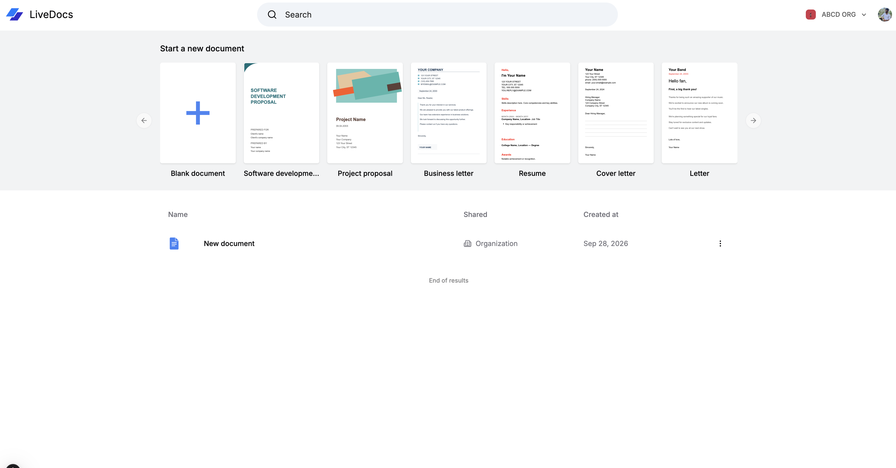
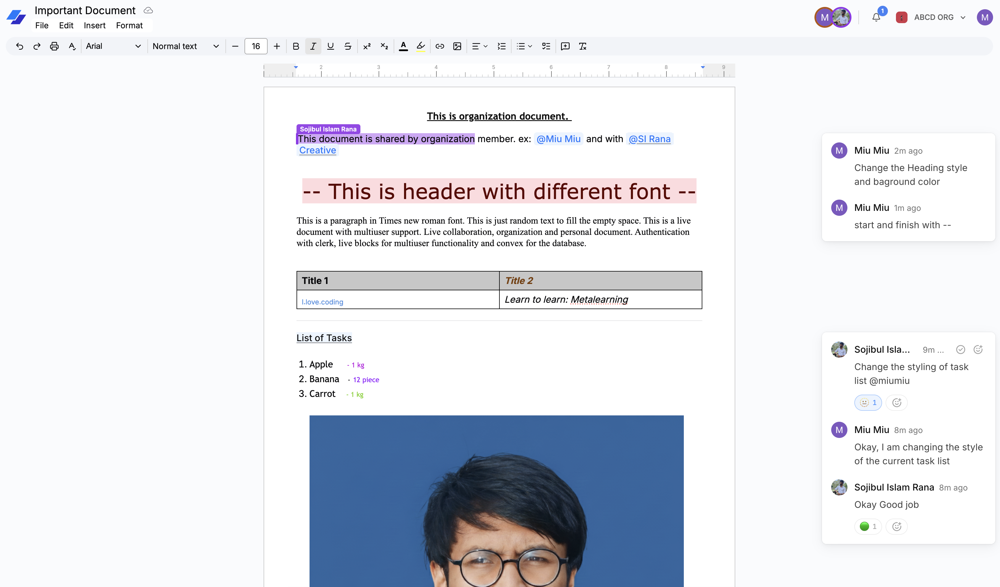

<div align="center">

# 📝 Live Doc

**A lightweight, real-time collaborative document editor.**

Create documents from a rich template gallery and write together with your team —
cursors, comments, and formatting sync instantly across every collaborator.

[![Live Demo][demo-badge]][demo-url]
[![Next.js][next-badge]][next-url]
[![TypeScript][ts-badge]][ts-url]
[![Tailwind CSS][tailwind-badge]][tailwind-url]
[![Convex][convex-badge]][convex-url]
[![Clerk][clerk-badge]][clerk-url]
[![Liveblocks][liveblocks-badge]][liveblocks-url]
[![TipTap][tiptap-badge]][tiptap-url]
[![MIT License][license-badge]][license-url]

</div>

---

## ✨ Features

- **Real-time collaboration** — multiple users edit the same document at once.
  Live cursors, text selections, and formatting changes are broadcast instantly
  through Liveblocks, with a deterministic color assigned to each user.
- **Comments & mentions** — attach threads to any selection, resolve them, and
  `@mention` teammates (including Clerk organization members) for notification.
- **Rich formatting toolbar** — headings, bold/italic/underline, strikethrough,
  superscript/subscript, text & highlight colors, font family/size, line height,
  text alignment, links, images (with resize), tables, and task lists.
- **Document templates** — one-click start from a carousel of templates
  (software proposal, resume, cover letter, business letter, and more).
- **File import** — open `.docx`, `.pdf`, `.txt`, and `.html` files directly in
  the editor (all parsing happens client-side).
- **Export & print** — download any document as JSON, HTML, or plain text, and
  print to PDF with a clean page layout.
- **Word-processor feel** — a Google-Docs-style page canvas with a draggable
  **ruler** to adjust left/right margins. Margins are shared state, so every
  collaborator sees the same page. Double-click a margin marker to reset it.
- **Organizations** — documents can belong to a Clerk organization or a
  personal workspace. Owners can delete documents; members edit and rename.
- **Search** — full-text search over your documents with title highlighting and
  paginated results.
- **Inbox** — Liveblocks inbox notifications for comments and mentions.

## 🖼️ Screenshots





## 🧰 Tech Stack

| Layer            | Technology                                                                    |
| ---------------- | ----------------------------------------------------------------------------- |
| Framework        | [Next.js 15][next-url] (App Router) + React 19                                 |
| Language         | [TypeScript][ts-url]                                                           |
| Styling          | [Tailwind CSS][tailwind-url] + [shadcn/ui](https://ui.shadcn.com) components   |
| Backend / BaaS   | [Convex][convex-url] (reactive database, server functions)                     |
| Authentication   | [Clerk][clerk-url] (user accounts, sessions, organizations)                    |
| Real-time engine | [Liveblocks][liveblocks-url] (presence, storage, threads, inbox)               |
| Rich text editor | [TipTap][tiptap-url] (ProseMirror-based)                                       |
| File handling    | `mammoth` (DOCX), `pdfjs-dist` (PDF), `react-color`                           |
| Forms / tools    | React Hook Form, Zod, date-fns, lucide-react, react-icons, nuqs, zustand       |

## 🚀 Getting Started

### Prerequisites

- **Node.js ≥ 18.18** and npm
- Accounts (free tiers are enough):
  - [Convex](https://convex.dev) — database & backend
  - [Clerk](https://clerk.com) — authentication
  - [Liveblocks](https://liveblocks.io) — real-time infrastructure

### Installation

```bash
# 1. Clone the repository
git clone https://github.com/sojibulislamrana/live-docs.git
cd live-docs

# 2. Install dependencies
npm install

# 3. Configure environment variables
cp .env.example .env.local
```

### Environment Variables

| Variable                            | Required | Description                                        |
| ----------------------------------- | :------: | -------------------------------------------------- |
| `NEXT_PUBLIC_CONVEX_URL`            |    ✅    | Convex deployment URL (Dashboard → Deployments)    |
| `NEXT_PUBLIC_CLERK_PUBLISHABLE_KEY` |    ✅    | Clerk publishable key                              |
| `CLERK_SECRET_KEY`                  |    ✅    | Clerk secret key (server-only)                     |
| `LIVEBLOCKS_SECRET_KEY`             |    ✅    | Liveblocks secret used to mint access tokens       |

### Run locally

```bash
npm run dev
```

Open [http://localhost:3000](http://localhost:3000), sign in with Clerk, and
invite a second account (or a second browser) to see collaboration live.

> During development the Convex backend must be reachable — either via a hosted
> deployment (`npx convex deploy`) or a local dev backend (`npx convex dev`).

## 📜 Available Scripts

| Script              | Description                                   |
| ------------------- | --------------------------------------------- |
| `npm run dev`       | Start the Next.js development server          |
| `npm run build`     | Create an optimized production build          |
| `npm run start`     | Serve the production build locally            |
| `npm run lint`      | Run ESLint                                    |
| `npm run typecheck` | Run TypeScript type checking (`tsc --noEmit`) |

## 🗂️ Project Structure

```
live-docs/
├── app/                        # Next.js App Router
│   ├── (auth)/                 # Sign-in / sign-up pages
│   ├── (home)/                 # Dashboard, template gallery, document table
│   ├── api/                    # Route handlers
│   │   ├── liveblocks-auth/                    # Mint Liveblocks access tokens
│   │   ├── liveblocks-mention-suggestions/     # Resolve @mention suggestions
│   │   └── liveblocks-users/                   # Resolve collaborator profiles
│   └── documents/[documentId]/ # Editor, toolbar, ruler, threads, inbox
├── components/                 # Reusable UI (shadcn/ui) and app components
├── constant/                   # Document templates gallery data
├── convex/                     # Convex schema + server functions
├── extensions/                 # Custom TipTap extensions (font size, line height)
├── hooks/                      # Custom React hooks
├── lib/                        # Utilities (import-file, colors, display names)
├── store/                      # Zustand editor store
└── middleware.ts               # Clerk middleware (auth on all routes)
```

## 🛢️ Data Model (Convex)

Documents are stored in the `document` table:

| Field            | Type      | Notes                                            |
| ---------------- | --------- | ------------------------------------------------ |
| `title`          | `string`  | Document title                                   |
| `initialContent` | `string?` | HTML seed content (templates, imports, …)        |
| `ownerId`        | `string`  | Clerk user id of the owner (can delete)          |
| `roomId`         | `string?` | Liveblocks room id (defaults to the document id) |
| `organizationId` | `string?` | Clerk organization the document belongs to       |

Indexed by owner and organization, with a full-text search index on `title`.
Shared page margins (`leftMargin`, `rightMargin`) live in Liveblocks Storage so
they stay in sync across collaborators without a DB write per drag event.

## ☁️ Deployment

### Vercel

1. Push this repository to GitHub and import it at
   [vercel.com/new](https://vercel.com/new) — Next.js is auto-detected.
2. Add the four environment variables from [`.env.example`](.env.example) to
   **Project → Settings → Environment Variables**.
3. Deploy, then add `https://live-docs-mu-nine.vercel.app` (or your custom
   domain) to Clerk's **Allowed origins / Redirect URLs**.

### Convex Backend

```bash
npx convex deploy
```

This publishes the server functions and schema to your Convex deployment. Keep
`NEXT_PUBLIC_CONVEX_URL` in Vercel pointing at the same one.

## 🤝 Contributing

Contributions are what make the open-source community great — bug reports, new
features, and documentation are all welcome!

Please read [CONTRIBUTING.md](CONTRIBUTING.md) and follow the
[Code of Conduct](CODE_OF_CONDUCT.md). In short:

1. Fork the repo and create a branch (`feat/…`, `fix/…`, `docs/…`).
2. Make focused, well-tested changes.
3. Open a pull request describing *what* and *why*.

## 📄 License

Distributed under the [MIT License](LICENSE).

## 🧑‍💻 Author

**Sojibul Islam Rana**

[][github-url]

---

<p align="center">Made with ❤️ for collaborative writing.</p>

<!-- Badges & links -->
[demo-badge]: https://img.shields.io/badge/Live%20Demo-vercel.app-000000.svg?logo=vercel&logoColor=white
[demo-url]: https://live-docs-mu-nine.vercel.app/
[next-badge]: https://img.shields.io/badge/Next.js%2015-000000?logo=nextdotjs&logoColor=white
[ts-badge]: https://img.shields.io/badge/TypeScript-3178C6?logo=typescript&logoColor=white
[tailwind-badge]: https://img.shields.io/badge/TailwindCSS-06B6D4?logo=tailwindcss&logoColor=white
[convex-badge]: https://img.shields.io/badge/Convex-0A0A2E?logo=convex&logoColor=white
[clerk-badge]: https://img.shields.io/badge/Clerk-6C47FF?logo=clerk&logoColor=white
[liveblocks-badge]: https://img.shields.io/badge/Liveblocks-000000?logo=liveblocks&logoColor=white
[tiptap-badge]: https://img.shields.io/badge/TipTap-3A3A3A?logo=tiptap&logoColor=white
[license-badge]: https://img.shields.io/badge/License-MIT-yellow.svg

[next-url]: https://nextjs.org/
[ts-url]: https://www.typescriptlang.org/
[tailwind-url]: https://tailwindcss.com/
[convex-url]: https://convex.dev
[clerk-url]: https://clerk.com
[liveblocks-url]: https://liveblocks.io
[tiptap-url]: https://tiptap.dev
[license-url]: LICENSE
[github-url]: https://github.com/sojibulislamrana
